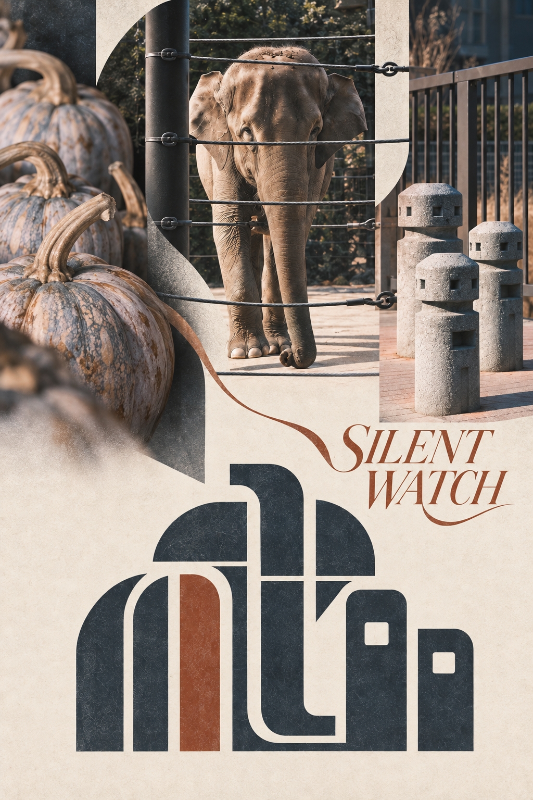

<div align="center">

# 【S.008】Starryear-Logo丨星年·印记

**把 2–5 张散装照片提炼为摄影、英文艺术字与原创品牌标志共生的竖版视觉识别作品。**


[](./LICENSE.md)


</div>

---

## ⚠️ 声明

> **仅限个人学习、非营利研究与非商业创作。**任何商业使用均须事先取得 Starryear年 的书面许可。分享作品时，欢迎标注来源并 **@Starryear年**。

## 📖 关于本项目

S-008 将主题、视角和尺度各异的 2–5 张照片视作一个视觉集合：上部以非模板化方式重组真实照片，中部以单一英文艺术字形成视觉过渡，下部生成一个占据主导地位的原创 Brand Symbol。

- ✅ 每组照片产生独立的版式、几何、色板和标志逻辑
- ✅ 标志中的每个关键构件均可追溯至输入照片
- ✅ 英文艺术字、照片与标志通过跨区线索和负形融合为一体
- ✅ 避免机械三栏，强调主次、错位、跨幅与“啊哈”式视觉接力
- ❌ 不套用圆形、太阳、山、相机光圈、定位针、盾牌或字母 monogram 模板

> Skill 内含中文说明版与英文说明版完整提示词；成品画面只使用英文艺术字。

## 🖼️ 示例作品

<div align="center">



*S-008 成品示例｜SILENT WATCH*

</div>

## 📋 目录

- [使用方法](#-使用方法)
- [可自由调整的部分](#️-可自由调整的部分)
- [核心原则](#-核心原则)
- [内容结构](#-内容结构)
- [许可证](#-许可证)

## 🚀 使用方法

### 方式一：作为 Codex Skill 使用

1. 将整个 `s-008-starryear-visual-mark` 文件夹复制到 Codex skills 目录。
2. 新开对话并上传 2–5 张照片。
3. 输入：`使用 $s-008-starryear-visual-mark，把这些照片做成一张影像成标作品。`
4. Skill 返回一张竖版 2:3 完成图；不返回分析、草案或多套候选。

### 方式二：直接使用提示词

| 语言 | 文件 |
| :---: | :--- |
| 中文 | [references/s-008-starryear-visual-mark-prompt.zh-CN.md](references/s-008-starryear-visual-mark-prompt.zh-CN.md) |
| English | [references/s-008-starryear-visual-mark-prompt.en.md](references/s-008-starryear-visual-mark-prompt.en.md) |

## 🎛️ 可自由调整的部分

| 参数 | 说明 |
| :--- | :--- |
| **上部照片组织** | 可采用非均分网格、跨格裁切、窄条、留白或受控重叠，但照片仍须真实可辨 |
| **标志复杂度** | 可在极简实体标志与 3–7 个源生构件的融合标志之间调整 |
| **色彩策略** | 默认从照片提炼 2–4 个主色与至多 1 个强调色，也可按用户指定色板收束 |
| **英文艺术字** | 优先使用用户提供的英文；未提供时生成简短、与照片有关的 1–3 词英文命名 |

## 💡 核心原则

1. **方法固定，版式自适应** — 固定“集合观察—视觉 DNA—抽象融合—品牌化定稿”，不固定模板外观。
2. **证据可追溯** — 上部保留摄影真实性；下部标志的形状、负空间和色彩均来自本组照片。
3. **标志先于插画** — 下部必须像可识别、可缩放、可复现的品牌符号，而非场景插画或装饰拼贴。
4. **整体视觉接力** — 用源照片中的方向、轮廓、负形或色彩贯通照片、英文艺术字与主标志。

## 📁 内容结构

```text
s-008-starryear-visual-mark/
├── README.md
├── LICENSE.md
├── SKILL.md
├── agents/openai.yaml
├── references/
│   ├── s-008-starryear-visual-mark-prompt.zh-CN.md
│   └── s-008-starryear-visual-mark-prompt.en.md
└── assets/examples/
```

> `assets/examples/` 仅收录由 Starryear年 提供或明确认可的最终成品图。

## 📄 许可证

本项目采用 [LICENSE.md](./LICENSE.md) 中规定的使用条款。

<div align="center">

**如果这个项目对你有帮助，欢迎 Star ⭐ 支持！**

</div>
